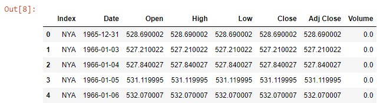
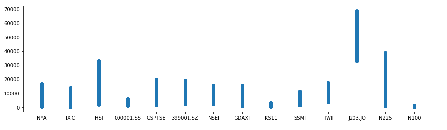
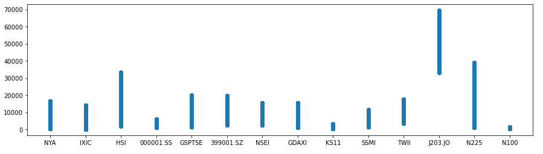
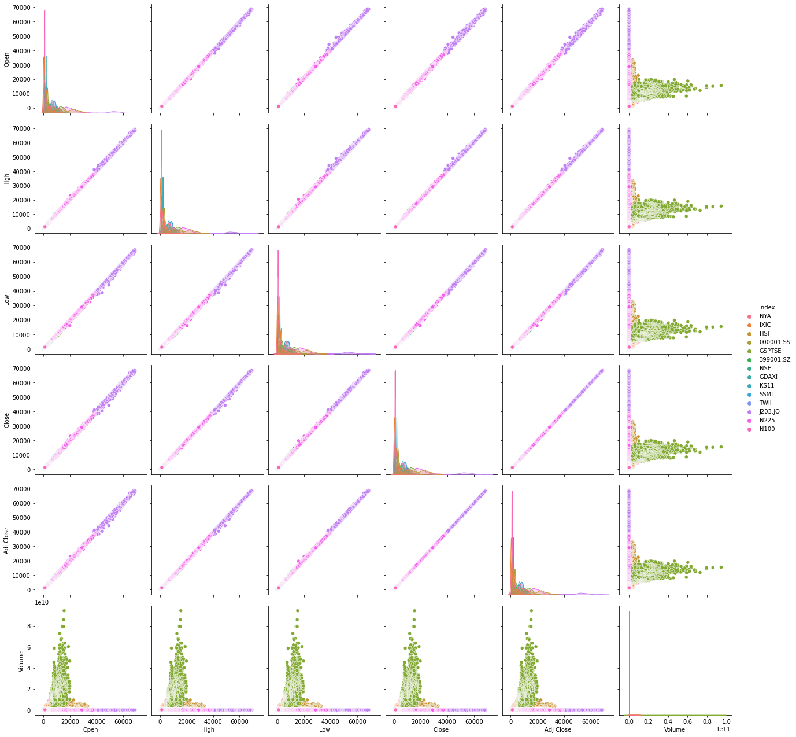
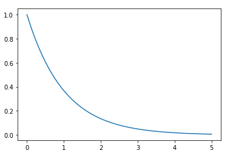
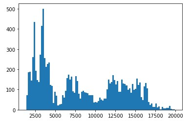

# A simple analysis of the stock exchange data

For this project I took into account a dataset containing information regarding some of the stock exchange present on the market with their different

- index
- opening value
- high value
- low value
- closing value
- adjusted close value
- eventual volume (if applicable)

With that in mind, I want to start exploring the data to see first of all the various trend for the single stock and then analyse the various information I have to make some future engineering and analysis

```python
import pandas.io.sql as pds
import pandas as pd
import matplotlib.pyplot as plt
import seaborn as sns

# read the data from the file
filepath = 'indexData.csv'
data = pd.read_csv(filepath)
print(data.iloc[:5])
```

showing the following data




The data is displayed properly but for some date in the dataset we have a null value; to better see what data are represented I plot both the low

```python
# show initial plot for low
plt.figure(figsize=(15, 4))
plt.plot(data.Index, data.Low, ls='', marker='o')
```

represented by the plot




as well as the high data

```python
# show initial plot for high
plt.figure(figsize=(15, 4))
plt.plot(data.Index, data.High, ls='', marker='o')
```

represented by the plot




Considering the high amount of data, it seems like the `null` value does not have such a high impact on the result, I can start working on the dataset by removing those data and see if it will have a strong impact or not, I can simply do that by creating a `DataFrame`  and removing the null

```python
df = pd.DataFrame(data)

# drop the null
df = df.dropna(how='any', axis=0)
```

and then I check again if the plot still have everything in order using `seaborn`

```python
sns.pairplot(data, hue='Index', height=3)
```

which shows the following graph




From the graph I can see that the stocks have been growing linearly, and the volume of the stocks exchanged have a very high and steep peak for **GSPTSE** (which might be biased since the data present on the dataset had lots of data to 0, so we should check if in those years there were really no exchange or if they simply don't have the information).

As of now, there are three hypothesis I want to study:

1. the market is fair
2. the high volume have an impact on the value of the stock
3. considering the trending, the stock market should get bigger over time

Let's now check if the high volume actually have an impact on the value of the stock; moreover, I'll check the increment in the value in the period of 3 years (from 1981 to 1984) in which we don't have the data, and I'll map that with an exponential model for the following years, to check the following:

- if the volume does not change and the market is fair, we can predict with a 5% the next value
- if the value is bigger, it means that the volume of exchange and the market itself do have an impact

To check it I'll use the exponential and I'll proceed as follow:

```python
from scipy.stats import expon

numargs = expon.numargs
[ ] = [1.03, ] * numargs
rv = expon( )
```

to create the exponential; then I'll get the data and the various element from the series

```python
location = df.loc[:, ['Index', 'Open']]
queryLoc = location.query('Index == "GSPTSE"')
gsptseData = queryLoc.loc[:, 'Open']
gsptseData.values
```

and then get the quantiles

```python
quantile_data = []

perc = 0.25
for i in range(4):
    quantile_data.append(np.quantile(gsptse, perc))
    perc += 0.25
    
quantile_data
```

I can then create the data for the random variates and their distribution

```python
randomVs = expon.rvs(scale = 2,  size = 10)
print ("Random Variates : \n", randomVs)
  
# PDF
randomVs = expon.pdf(quantile_data, loc = 0, scale = 10000)
print ("\nProbability Distribution : \n", randomVs)
```

and create the graph as well




And to better see if the trend follows the one of the exponential I can plot the entire graph for the change of the stock as well

```python
plt.hist(gsptseData.values, bins=100)
plt.show()
```

Showing a very skewed graph, with a focus on values in the interval 2000-4500 but with values going up to 20000 (which is around the value it has now); this shows that the data has gone way beyond the trending of the data from an increase in the year going (in the years from 1981 to 1984 there was an increase of 103%, going to to 123% after adding the volume due to the buy and sells of stocks).




This shows that the market is not a fair environment, and that buying or selling stocks can change their values.