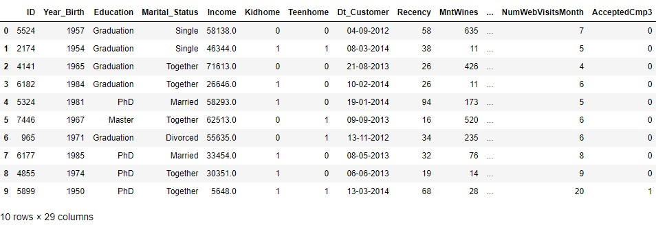
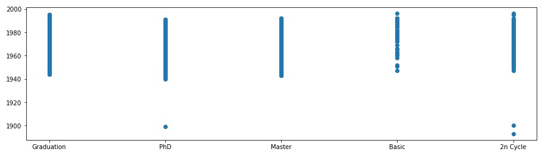
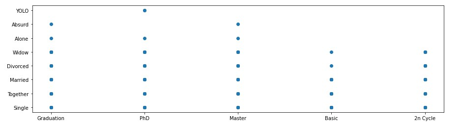
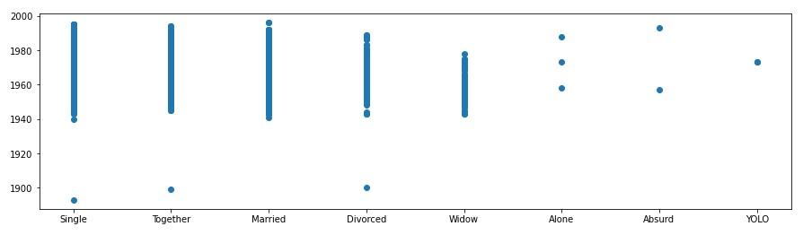
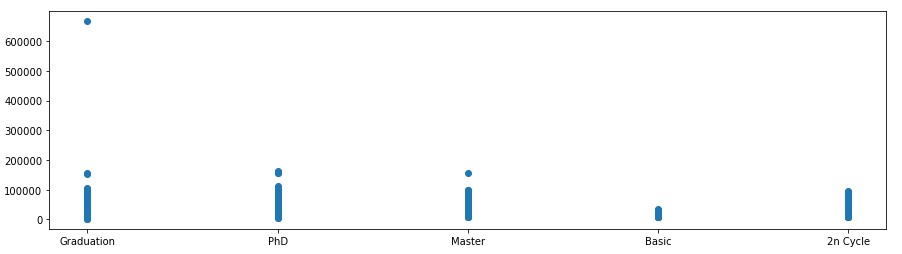
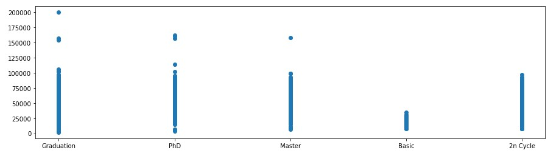
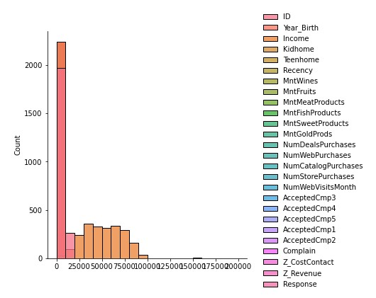
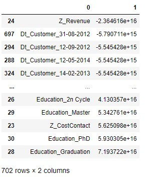

# Marketing campaign analysis

## Initial description

The data set I decided to take into account is the *marketing campaign* dataset present on the website https://www.kaggle.com/imakash3011/customer-personality-analysis and contains analysis of a company's ideal customers based on information regarding the various customers, and then apply some linear regression to check if we can correctly **predict** the income of the customers. I start with importing the bases classes for our analysis

```python
import pandas.io.sql as pds
import pandas as pd
import matplotlib.pyplot as plt
import seaborn as sns
import numpy as np
```

and then get the information from our csv file:

```python
# read the data from the file
filepath = 'marketing_campaign.csv'
data = pd.read_csv(filepath, sep='\t')

data.head(10)
```

to have a first idea of the data we are facing



As the initial foothold confirms, it contains 29 columns with the following dtypes (we can see it with a `data.dtypes`):

```
ID                       int64
Year_Birth               int64
Education               object
Marital_Status          object
Income                 float64
Kidhome                  int64
Teenhome                 int64
Dt_Customer             object
Recency                  int64
MntWines                 int64
MntFruits                int64
MntMeatProducts          int64
MntFishProducts          int64
MntSweetProducts         int64
MntGoldProds             int64
NumDealsPurchases        int64
NumWebPurchases          int64
NumCatalogPurchases      int64
NumStorePurchases        int64
NumWebVisitsMonth        int64
AcceptedCmp3             int64
AcceptedCmp4             int64
AcceptedCmp5             int64
AcceptedCmp1             int64
AcceptedCmp2             int64
Complain                 int64
Z_CostContact            int64
Z_Revenue                int64
Response                 int64
dtype: object
```

Among these, the one I want to focus more about is:

- **year birth**, whose information can be inspected with `data.Year_Birth.unique()`

  ```
  array([1957, 1954, 1965, 1984, 1981, 1967, 1971, 1985, 1974, 1950, 1983,
         1976, 1959, 1952, 1987, 1946, 1980, 1949, 1982, 1979, 1951, 1969,
         1986, 1989, 1963, 1970, 1973, 1943, 1975, 1996, 1968, 1964, 1977,
         1978, 1955, 1966, 1988, 1948, 1958, 1972, 1960, 1945, 1991, 1962,
         1953, 1961, 1956, 1992, 1900, 1893, 1990, 1947, 1899, 1993, 1994,
         1941, 1944, 1995, 1940], dtype=int64)
  ```

- **education**, whose values are given by `data.Education.unique()`:

  ```
  array(['Graduation', 'PhD', 'Master', 'Basic', '2n Cycle'], dtype=object)
  ```

- **marital status**, defined with `data.Marital_Status.unique()`:

  ```
  array(['Single', 'Together', 'Married', 'Divorced', 'Widow', 'Alone', 'Absurd', 'YOLO'], dtype=object)
  ```

- **income**, given by `data.Income.unique()`:

  ```
  array([58138., 46344., 71613., ..., 56981., 69245., 52869.])
  ```


## Data exploration

By the first attributes inspection something interesting can already be seen: in the marital status data, there are also "absurd" and "YOLO" (short for you only live once), which might be indicators of people with a very peculiar life style.

I start in making some plots regarding the information present in the data, in pairs to look into correlations between the various attributes:


---

###### Education - Year_Birth plot

I use `matplotlib` to draw a simple scatterplot

```python
# show initial plot
plt.figure(figsize=(15, 4))
plt.plot(data.Education, data.Year_Birth, ls='', marker='o')
```




###### Education - Marital_Status plot

Same procedure for the plot

```python
# show initial plot
plt.figure(figsize=(15, 4))
plt.plot(data.Education, data.Marital_Status, ls='', marker='o')
```




###### Marital_Status - Year_Birth

The plot from the marital status and year of birth in python is given in the same way

```python
# show initial plot
plt.figure(figsize=(15, 4))
plt.plot(data.Marital_Status, data.Year_Birth, ls='', marker='o')
```




###### Education - Income

The last plot I will look into is the one between education and income

```python
# show initial plot
plt.figure(figsize=(15, 4))
plt.plot(data.Education, data.Income, ls='', marker='o')
```



---


As a final, I also do a simple `pairplot` using Education as hue with `Seaborn`

```python
sns.pairplot(data, hue='Education', height=3)
```


### Data Cleaning

The dataset seems to be already clean; still, it already appears clear from the various plots, that there's a too high value for the income; inspecting with a `data.max()` shows which rows is responsible for this:

```
ID                          11191
Year_Birth                   1996
Education                     PhD
Marital_Status               YOLO
Income                   666666.0
Kidhome                         2
Teenhome                        2
Dt_Customer            31-12-2013
Recency                        99
MntWines                     1493
MntFruits                     199
MntMeatProducts              1725
MntFishProducts               259
MntSweetProducts              263
MntGoldProds                  362
NumDealsPurchases              15
NumWebPurchases                27
NumCatalogPurchases            28
NumStorePurchases              13
NumWebVisitsMonth              20
AcceptedCmp3                    1
AcceptedCmp4                    1
AcceptedCmp5                    1
AcceptedCmp1                    1
AcceptedCmp2                    1
Complain                        1
Z_CostContact                   3
Z_Revenue                      11
Response                        1
dtype: object
```

This data need either to be removed (might be losing information), or we either normalize it into the values of the range of the others incomes that we have. To change I can simply do

```python
data.loc[data['Income']==666666.0, 'Income'] = 200000.0
```

to set the value to 200000.0 (which is still the maximum value but it is now normalized to the others), and I can now see that the plot is now normalized



Also, it appears that there are three people born before 1900 which might be a bit weird as it would imply that, at the time the dataset was created, three people were around 100 years old (still this is not enough of an information to draw some conclusion on).

### Feature Engineering

I start by checking information with a seaborn plot to check if the data are already normalized in the centre with a

```python
sns.displot(data, bins=20)
```

and I get the following:




As it appears, the data have a very high count for values from 0 and 1, as many columns (like response, or Z_revenue) have standard values that are 0 or 1 (apart from Z_revenue which is always 11); I can therefore move one into making some linear regression models.

I need to modify the information I got to something that will be reproducible for our models using encoding using one hot encoding with dummies:

```python
pd.get_dummies(df['Education'], prefix='Education', drop_first=True)

df = pd.concat([df,pd.get_dummies(df['Education'], prefix='Education')],axis=1)

# now drop the original 'country' column (you don't need it anymore)
df.drop(['Education'],axis=1, inplace=True)

pd.get_dummies(df['Marital_Status'], prefix='Marital_Status', drop_first=True)

df = pd.concat([df,pd.get_dummies(df['Marital_Status'], prefix='Marital_Status')],axis=1)

# now drop the original 'country' column (you don't need it anymore)
df.drop(['Marital_Status'],axis=1, inplace=True)

pd.get_dummies(df['Dt_Customer'], prefix='Dt_Customer', drop_first=True)

df = pd.concat([df,pd.get_dummies(df['Dt_Customer'], prefix='Dt_Customer')],axis=1)

# now drop the original 'country' column (you don't need it anymore)
df.drop(['Dt_Customer'],axis=1, inplace=True)
```

After that I'll just reset the index and set all not number value remaining to 0

```python
df = df.reset_index()
df = df.fillna(0)
```


## Linear Regression

I can now setup the training set and apply a Linear Regression on it; I'll do a simple Linear Regression, a Ridge, and a Lasso one, using the Income to check if we can predict the income of our customers well enough.

I start by setting up the data

```python
y_col = "Income"

X = data.drop(y_col, axis=1)
y = data[y_col]
```

from that I can start out linear regression part

```python
from sklearn.preprocessing import StandardScaler

s = StandardScaler()
X_ss = s.fit_transform(X)

from sklearn.linear_model import LinearRegression

lr2 = LinearRegression()
lr2.fit(X_ss, y)
print(lr2.coef_) # coefficients now "on the same scale"
```

from that we can also check which are the most impactful features we have




### Using Lasso for Linear Regression

As before we will do a linear regression, so we start importing the classes

```python
from sklearn.linear_model import Lasso
from sklearn.preprocessing import PolynomialFeatures
```

I start adding the polynomial features on the dataset

```python
pf = PolynomialFeatures(degree=2, include_bias=False,)
X_pf = pf.fit_transform(X)
```

and then create the data for the linear regression and do the train and test

```python
from sklearn.model_selection import train_test_split

las = Lasso()
las.fit(X_pf_ss, y)
las.coef_ 

from sklearn.metrics import r2_score
r2_score(y,las.predict(X_pf_ss))

X_train, X_test, y_train, y_test = train_test_split(X_pf, y, test_size=0.3, random_state=72018)

# Decreasing regularization and ensuring convergence
las001 = Lasso(alpha = 0.001, max_iter=100000)
X_train_s = s.fit_transform(X_train)
las001.fit(X_train_s, y_train)
X_test_s = s.transform(X_test)
y_pred = las001.predict(X_test_s)

# Calculating r2 score
print("r2 score for alpha = 0.001:", r2_score(y_pred, y_test))


lr = LinearRegression()
lr.fit(X_train_s, y_train)
y_pred_lr = lr.predict(X_test_s)

# Calculating r2 score
print("r2 score for Linear Regression:", r2_score(y_pred_lr, y_test))


print('Magnitude of Lasso coefficients:', abs(las001.coef_).sum())
print('Number of coeffients not equal to 0 for Lasso:', (las001.coef_!=0).sum())

print('Magnitude of Linear Regression coefficients:', abs(lr.coef_).sum())
print('Number of coeffients not equal to 0 for Linear Regression:', (lr.coef_!=0).sum())
```

As noticed we do both the linear regression with and without the Lasso to check whether using Lasso can improve our calculations. The result for our calculations were the following:

```
r2 score for alpha = 0.001: 0.3661671604544462
r2 score for Linear Regression: 0.10913406056965069
Magnitude of Lasso coefficients: 1003547.1721249411
Number of coeffients not equal to 0 for Lasso: 15335
Magnitude of Linear Regression coefficients: 514691.7673872624
Number of coeffients not equal to 0 for Linear Regression: 15954
```


### Using Ridge for Linear Regression

The final linear regression I take into account is the Ridge one and I do that with the same syntax used for the Lasso one, using also the same alpha

```python
from sklearn.linear_model import Ridge

# Decreasing regularization and ensuring convergence; I use the same alpha for Lasso
r = Ridge(alpha = 0.001)
X_train_s = s.fit_transform(X_train)
r.fit(X_train_s, y_train)
X_test_s = s.transform(X_test)
y_pred_r = r.predict(X_test_s)

# Calculating r2 score
r.coef_
```

showing smaller coefficients

```
array([ 3.47999647e+01,  1.13189153e+02, -1.65504323e+02, ...,
       -1.63149865e+01,  0.00000000e+00, -1.27724041e-01])
```

With a score for `r2` of

```
r2 score for alpha = 0.001: 0.10979764211553444
```

And, as last, I also see the sum of the coefficients for Ridge and Lasso

```python
print(np.sum(np.abs(r.coef_)))
print(np.sum(np.abs(las001.coef_)))

print(np.sum(r.coef_ != 0))
print(np.sum(las001.coef_ != 0))
```

that gives the following result:

```
514250.0803133368
1003547.1721249411
15848
15335
```


## Which model is the best?

Given the previous result, Lasso did have good value given the various coefficient compared to the simple Linear Regression but with a value that is not very close to the one given by the Linear Regression; for that, the Ridge Linear Regression did a much better job, both for the absolute value of coefficient (lower numbers), the amount of coefficient that goes to zero is slightly higher, but the `r2` score is also much closer to the one calculated by the simple Linear Regression.


## Next step

During this work I analysed the data to check if I could in some way predict the income of the customer based on the data I had and the information I got was rather promising; for possible feature studies, it might be worth spending more time in finding the function that maps the trending, as well as looking into information for prediction also based on the education as well as year of birth.

