# Heart attack project

For the classification project I want to inspect a data containing information related to various users with different data found at https://www.kaggle.com/rashikrahmanpritom/heart-attack-analysis-prediction-dataset

The main objective will be to study the data and ultimately predic and classify heart attack based on the training data we have.

## Main attributes

The attribute that I have in my csv file and that I will use as features are the following 

- *age*
- *sex*
- *exang*: exercise induced angina (1 = yes; 0 = no)
- *ca*: number of major vessels (0-3)
- *cp* is the chest pain:
    - Value 1: typical angina
    - Value 2: atypical angina
    - Value 3: non-anginal pain
    - Value 4: asymptomatic
- *trtbps*: resting blood pressure (in mm Hg)
- *chol*: cholestoral in mg/dl fetched via BMI sensor
- *fbs*: (fasting blood sugar > 120 mg/dl) (1 = true; 0 = false)
- *rest_ecg*: resting electrocardiographic results
    - Value 0: normal
    - Value 1: having ST-T wave abnormality (T wave inversions and/or ST elevation or depression of > 0.05 mV)
    - Value 2: showing probable or definite left ventricular hypertrophy by Estes' criteria
- *thalach*: maximum heart rate achieved
- *target*: 0= less chance of heart attack 1= more chance of heart attack


I start importing the base class

```python
import pandas.io.sql as pds
import pandas as pd
import matplotlib.pyplot as plt
import seaborn as sns
import numpy as np
```

and reading the csv file

```python
# read the data from the file
filepath = 'heart.csv'
data = pd.read_csv(filepath, sep=',')

data.head(10)
```

Inspecting the content with a simple `data.dtype` shows that we are working with only numeric data

```
age           int64
sex           int64
cp            int64
trtbps        int64
chol          int64
fbs           int64
restecg       int64
thalachh      int64
exng          int64
oldpeak     float64
slp           int64
caa           int64
thall         int64
output        int64
dtype: object
```

Also, for better understanding, I inspected the content of the min and max values with `data.min()` and `data.max()`

```
age          77.0
sex           1.0
cp            3.0
trtbps      200.0
chol        564.0
fbs           1.0
restecg       2.0
thalachh    202.0
exng          1.0
oldpeak       6.2
slp           2.0
caa           4.0
thall         3.0
output        1.0
dtype: float64
```

for the **min**, and

```
age          29.0
sex           0.0
cp            0.0
trtbps       94.0
chol        126.0
fbs           0.0
restecg       0.0
thalachh     71.0
exng          0.0
oldpeak       0.0
slp           0.0
caa           0.0
thall         0.0
output        0.0
dtype: float64
```

for the **max**.


### Visual representation of data


To have a better representation of the data, I plot the various information. 


---

#### Plot with chest pain and age

I start by plotting the correlation between  *chest pain* and *age*

```python
plt.figure(figsize=(15, 4))
plt.plot(data.cp, data.age, ls='', marker='o')
```


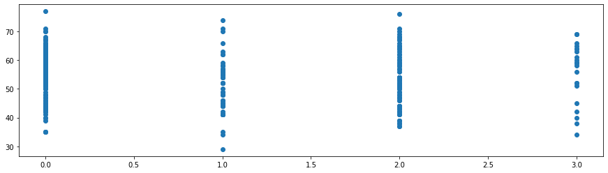


#### Plot with resting blood pressure and age

This time the data will be more "sparse"

```python
plt.figure(figsize=(15, 4))
plt.plot(data.trtbps, data.age, ls='', marker='o')
```

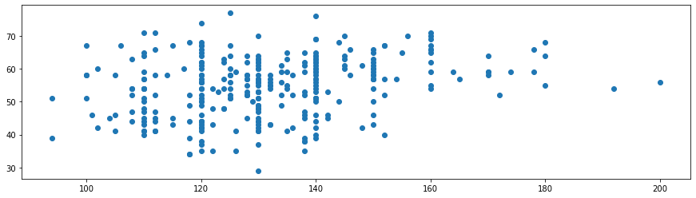


#### Plot with cholesterol and age

Another data of which I want to see the visual distribution is between age and cholesterol levels

```python
plt.figure(figsize=(15, 4))
plt.plot(data.chol, data.age, ls='', marker='o')
```

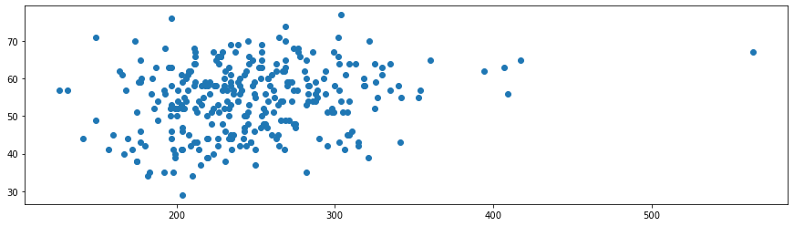


#### Plot with maximum heart rate and age

The last plot I want to see with the age is with the max heart rate

```python
plt.figure(figsize=(15, 4))
plt.plot(data.thalachh, data.age, ls='', marker='o')
```

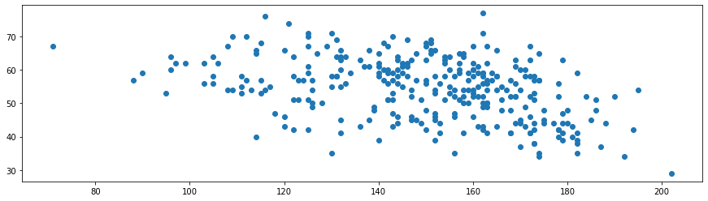

---


Lastly, I want to see the pairplot

```python
sns.pairplot(data, hue='age', height=3)
```

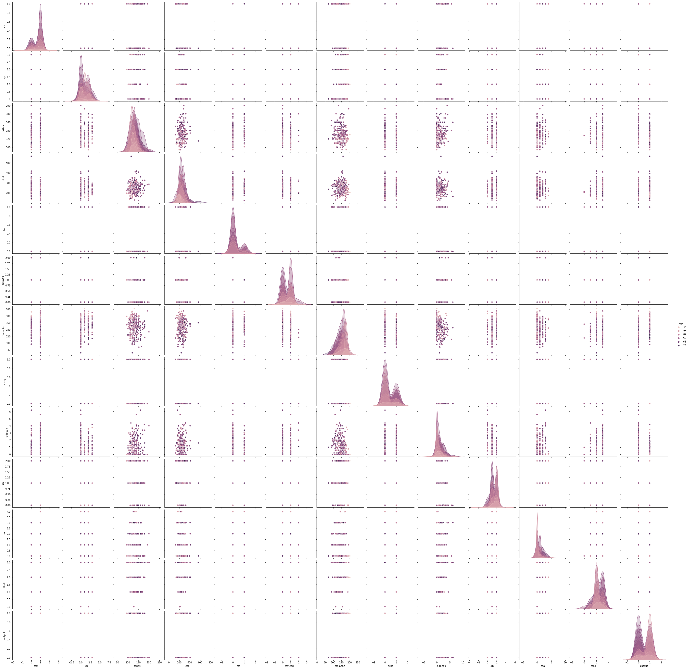


## Data cleaning and feature engineering

The dataset itself is already clean, and it already has an appropriate numerical labeling for the various data (see chest pain) that does not require any transformation with Label or the `OneHotEncoder`. To see more visually the data, I can also plot a simple heatmap

```python
fig, ax = plt.subplots(figsize=(15,10)) 
sns.heatmap(data.corr())
```

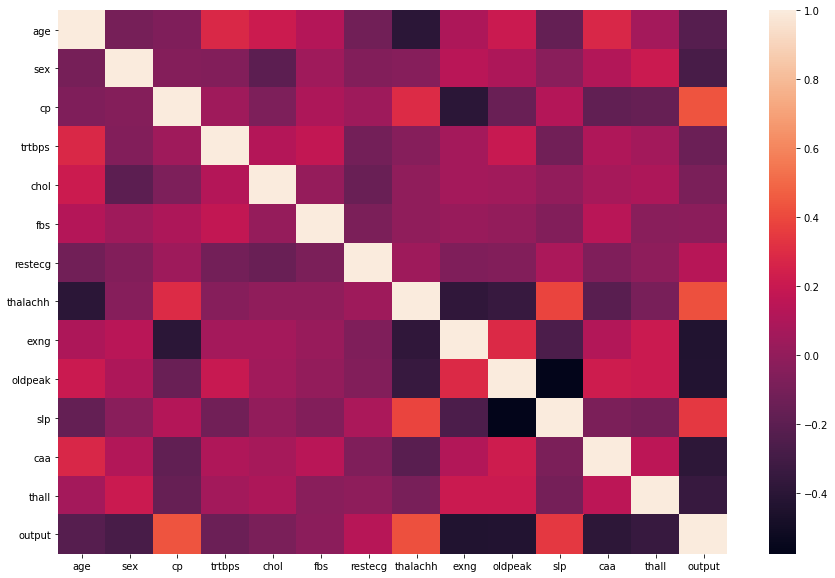


after that, I need to check if the data are already normalized or if they are skewed, and for that I plotted a simple distplot with the various data

```python
sns.displot(data, bins=30)
```

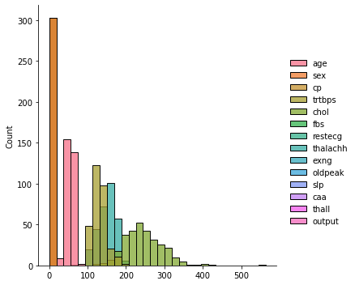

and the data shows to be already normalized, so there's no need to make logarithmic computation or other feature engineering.


## Classification model

I start with the preliminary preparation of the data with the various sets to use for train and test

```python
from sklearn.model_selection import StratifiedShuffleSplit

target = 'output'
feature_cols = [x for x in data.columns if x != 'output']


# Split the data into two parts with 1500 points in the test data
# This creates a generator
strat_shuff_split = StratifiedShuffleSplit(n_splits=1, test_size=80, random_state=42)

# Get the index values from the generator
train_idx, test_idx = next(strat_shuff_split.split(data[feature_cols], data[target]))

# Create the data sets
X_train = data.loc[train_idx, feature_cols]
y_train = data.loc[train_idx, target]

X_test = data.loc[test_idx, feature_cols]
y_test = data.loc[test_idx, target]
```


### Logistic regression

The first model I want to test my data with is a simple logistic regression; I'll do a standard logistic regression, and the logistic regression with cross-validation using both types of penality.

```python
from sklearn.linear_model import LogisticRegression

# Standard logistic regression
lr = LogisticRegression(solver='liblinear').fit(X_train, y_train)

from sklearn.linear_model import LogisticRegressionCV

# L1 regularized logistic regression
lr_l1 = LogisticRegressionCV(Cs=10, cv=4, penalty='l1', solver='liblinear').fit(X_train, y_train)

# L2 regularized logistic regression
lr_l2 = LogisticRegressionCV(Cs=10, cv=4, penalty='l2', solver='liblinear').fit(X_train, y_train)
```

and the try to make a prediction based on the data we have

```python
# Predict the class and the probability for each
y_pred = list()
y_prob = list()

coeff_labels = ['lr', 'l1', 'l2']
coeff_models = [lr, lr_l1, lr_l2]

for lab,mod in zip(coeff_labels, coeff_models):
    y_pred.append(pd.Series(mod.predict(X_test), name=lab))
    y_prob.append(pd.Series(mod.predict_proba(X_test).max(axis=1), name=lab))
    
y_pred = pd.concat(y_pred, axis=1)
y_prob = pd.concat(y_prob, axis=1)

y_pred.head()
```

that shows the following result

|      |   lr |   l1 |   l2 |
| ---: | ---: | ---: | ---: |
|    0 |    1 |    1 |    1 |
|    1 |    0 |    0 |    0 |
|    2 |    1 |    1 |    1 |
|    3 |    1 |    1 |    1 |
|    4 |    0 |    0 |    0 |


I can then generate the score for 

- precision
- recall
- fscore
- accuracy
- auc


as follow:

```python
coeff_labels = ['lr', 'l1', 'l2']

from sklearn.metrics import precision_recall_fscore_support as score
from sklearn.metrics import confusion_matrix, accuracy_score, roc_auc_score
from sklearn.preprocessing import label_binarize

metrics = list()
cm = dict()

for lab in coeff_labels:

    # Preciision, recall, f-score from the multi-class support function
    precision, recall, fscore, _ = score(y_test, y_pred[lab], average='weighted')
    
    # The usual way to calculate accuracy
    accuracy = accuracy_score(y_test, y_pred[lab])
    
    # ROC-AUC scores can be calculated by binarizing the data
    auc = roc_auc_score(label_binarize(y_test, classes=[0,1]),
              label_binarize(y_pred[lab], classes=[0,1]), 
              average='weighted')
    
    # Last, the confusion matrix
    cm[lab] = confusion_matrix(y_test, y_pred[lab])
    
    metrics.append(pd.Series({'precision':precision, 'recall':recall, 
                              'fscore':fscore, 'accuracy':accuracy,
                              'auc':auc}, 
                             name=lab))

metrics = pd.concat(metrics, axis=1)
```

|           |       l1 |       l2 |       l2 |
| --------: | -------: | -------: | -------: |
| precision | 0.736847 | 0.724169 | 0.750000 |
|    recall | 0.737500 | 0.725000 | 0.750000 |
|    fscore | 0.736120 | 0.724127 | 0.748082 |
|  accuracy | 0.737500 | 0.725000 | 0.750000 |
|       auc | 0.731061 | 0.719697 | 0.742424 |

and then plot the final map

```python
fig, axList = plt.subplots(nrows=2, ncols=2)
axList = axList.flatten()
fig.set_size_inches(12, 10)

axList[-1].axis('off')

for ax,lab in zip(axList[:-1], coeff_labels):
    sns.heatmap(cm[lab], ax=ax, annot=True, fmt='d', cmap=colors);
    ax.set(title=lab);
    
plt.tight_layout()
```

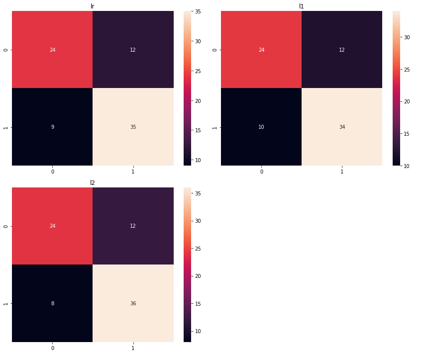


---

### Decision tree

The second model I will test my data with is the decision tree, and for this I'll use the same training and test data used before.

```python
from sklearn.tree import DecisionTreeClassifier

dt = DecisionTreeClassifier(random_state=42)
dt = dt.fit(X_train, y_train)
```

create the proper function to return error metrics

```python
from sklearn.metrics import accuracy_score, precision_score, recall_score, f1_score

def measure_error(y_true, y_pred, label):
    return pd.Series({'accuracy':accuracy_score(y_true, y_pred),
                      'precision': precision_score(y_true, y_pred),
                      'recall': recall_score(y_true, y_pred),
                      'f1': f1_score(y_true, y_pred)},
                      name=label)
```

and then create the prediction adding the errors:

```python
y_train_pred = dt.predict(X_train)
y_test_pred = dt.predict(X_test)

train_test_full_error = pd.concat([measure_error(y_train, y_train_pred, 'train'),
                              measure_error(y_test, y_test_pred, 'test')],
                              axis=1)

train_test_full_error
```

that gives the following output

|               | train | test     |
| ------------- | ----- | -------- |
| **accuracy**  | 1.0   | 0.675000 |
| **precision** | 1.0   | 0.714286 |
| **recall**    | 1.0   | 0.681818 |
| **f1**        | 1.0   | 0.697674 |


And I can finally plot the decision tree

```python
from io import StringIO
from IPython.display import Image
from sklearn.tree import export_graphviz
import pydotplus

# Create an output destination for the file
dot_data = StringIO()

export_graphviz(dt, out_file=dot_data, filled=True)
graph = pydotplus.graph_from_dot_data(dot_data.getvalue())

# View the tree image
filename = 'dec_tree.png'
graph.write_png(filename)
Image(filename=filename) 
```


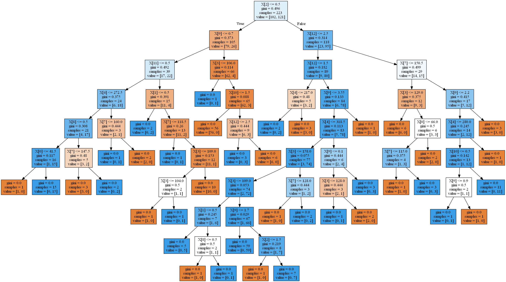


---

### Random Forest

For the last model, I'll create a random forest. I start by suppressing the warnings

```python
# Suppress warnings about too few trees from the early models
import warnings
warnings.filterwarnings("ignore", category=UserWarning)
warnings.filterwarnings("ignore", category=RuntimeWarning)
```

The first thing I have to do is by checking which value to use for the number of estimators

```python
from sklearn.ensemble import RandomForestClassifier

# Initialize the random forest estimator
# Note that the number of trees is not setup here
RF = RandomForestClassifier(oob_score=True, 
                            random_state=42, 
                            warm_start=True,
                            n_jobs=-1)

oob_list = list()

# Iterate through all of the possibilities for 
# number of trees
for n_trees in [15, 20, 30, 40, 50, 100, 150, 200, 300, 400]:
    
    # Use this to set the number of trees
    RF.set_params(n_estimators=n_trees)

    # Fit the model
    RF.fit(X_train, y_train)

    # Get the oob error
    oob_error = 1 - RF.oob_score_
    
    # Store it
    oob_list.append(pd.Series({'n_trees': n_trees, 'oob': oob_error}))

rf_oob_df = pd.concat(oob_list, axis=1).T.set_index('n_trees')

rf_oob_df
```

and see that the value gets stable at around 100 (with a value of 0.174)

| n_trees | oob      |
| ------- | -------- |
| 15.0    | 0.210762 |
| 20.0    | 0.170404 |
| 30.0    | 0.197309 |
| 40.0    | 0.197309 |
| 50.0    | 0.210762 |
| 100.0   | 0.174888 |
| 150.0   | 0.174888 |
| 200.0   | 0.165919 |
| 300.0   | 0.170404 |
| 400.0   | 0.165919 |


and to further showing this I can plot the out of bag errors

```python
sns.set_context('talk')
sns.set_style('white')

ax = rf_oob_df.plot(legend=False, marker='o', figsize=(14, 7), linewidth=5)
ax.set(ylabel='out-of-bag error');
```

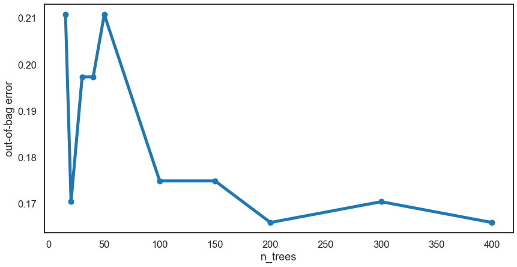


The value I'll go for is 100 (since 200 does not have that much of an impact) and create the forest to gather the results

```python
# Random forest with 100 estimators
model = RF.set_params(n_estimators=100)

y_pred = model.predict(X_test)

from sklearn.metrics import classification_report, accuracy_score, precision_score, recall_score
from sklearn.metrics import f1_score, roc_auc_score

cr = classification_report(y_test, y_pred)
print(cr)

score_df = pd.DataFrame({'accuracy': accuracy_score(y_test, y_pred),
                         'precision': precision_score(y_test, y_pred),
                         'recall': recall_score(y_test, y_pred),
                         'f1': f1_score(y_test, y_pred),
                         'auc': roc_auc_score(y_test, y_pred)},
                         index=pd.Index([0]))

print(score_df)
```

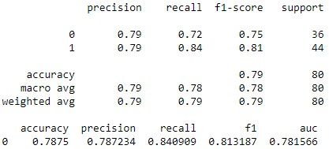


and finally plot the visual information

```python
from sklearn.metrics import roc_curve, precision_recall_curve, confusion_matrix

sns.set_context('talk')
cm = confusion_matrix(y_test, y_pred)
_, ax = plt.subplots(figsize=(12,12))
ax = sns.heatmap(cm, annot=True, fmt='d', annot_kws={"size": 40, "weight": "bold"})

labels = ['False', 'True']
ax.set_xticklabels(labels, fontsize=25);
ax.set_yticklabels(labels[::-1], fontsize=25);
ax.set_ylabel('Prediction', fontsize=30);
ax.set_xlabel('Ground Truth', fontsize=30)
```

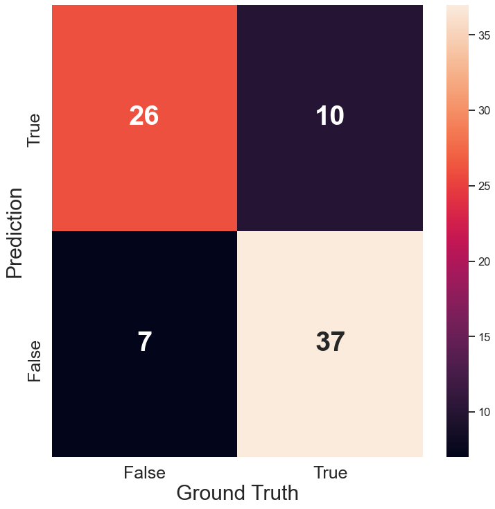


## Summary

As for the various data, as well as precision and recall, the random forest might be the best choice, also in terms of correct predictions, since it gave the least number of false positives and false negatives.

Overall the computation time was roughly the same, but this might be biased as the number of input data I gave my model with was quite small.

It would be very beneficial to have more data to compute the various model with a large dataset, as well as trying to compute the information with an ensembling method like stacking.

