# Marketing campaign clustering

## Initial description

The data set I decided to take into account is the *marketing campaign* dataset present on the website https://www.kaggle.com/imakash3011/customer-personality-analysis and contains analysis of a company's ideal customers based on information regarding the various customers, and then apply some clustering algorithms to check if we can correctly make clusters based on the incomes I have. I start with importing the bases classes for our analysis

```python
import pandas.io.sql as pds
import pandas as pd
import matplotlib.pyplot as plt
import seaborn as sns
import numpy as np
```

and then get the information from our csv file:

```python
# read the data from the file
filepath = 'marketing_campaign.csv'
data = pd.read_csv(filepath, sep='\t')

data.head(10)
```

to have a first idea of the data we are facing

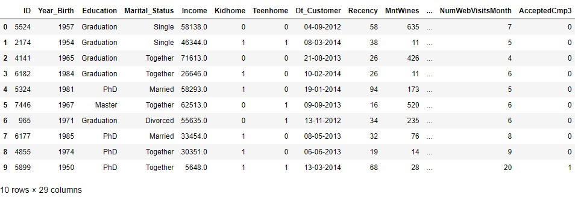

As the initial foothold confirms, it contains 29 columns with the following dtypes (we can see it with a `data.dtypes`):

```
ID                       int64
Year_Birth               int64
Education               object
Marital_Status          object
Income                 float64
Kidhome                  int64
Teenhome                 int64
Dt_Customer             object
Recency                  int64
MntWines                 int64
MntFruits                int64
MntMeatProducts          int64
MntFishProducts          int64
MntSweetProducts         int64
MntGoldProds             int64
NumDealsPurchases        int64
NumWebPurchases          int64
NumCatalogPurchases      int64
NumStorePurchases        int64
NumWebVisitsMonth        int64
AcceptedCmp3             int64
AcceptedCmp4             int64
AcceptedCmp5             int64
AcceptedCmp1             int64
AcceptedCmp2             int64
Complain                 int64
Z_CostContact            int64
Z_Revenue                int64
Response                 int64
dtype: object
```

Among these, the one I want to focus more about is:

- **year birth**, whose information can be inspected with `data.Year_Birth.unique()`

  ```
  array([1957, 1954, 1965, 1984, 1981, 1967, 1971, 1985, 1974, 1950, 1983,
         1976, 1959, 1952, 1987, 1946, 1980, 1949, 1982, 1979, 1951, 1969,
         1986, 1989, 1963, 1970, 1973, 1943, 1975, 1996, 1968, 1964, 1977,
         1978, 1955, 1966, 1988, 1948, 1958, 1972, 1960, 1945, 1991, 1962,
         1953, 1961, 1956, 1992, 1900, 1893, 1990, 1947, 1899, 1993, 1994,
         1941, 1944, 1995, 1940], dtype=int64)
  ```

- **education**, whose values are given by `data.Education.unique()`:

  ```
  array(['Graduation', 'PhD', 'Master', 'Basic', '2n Cycle'], dtype=object)
  ```

- **marital status**, defined with `data.Marital_Status.unique()`:

  ```
  array(['Single', 'Together', 'Married', 'Divorced', 'Widow', 'Alone', 'Absurd', 'YOLO'], dtype=object)
  ```

- **income**, given by `data.Income.unique()`:

  ```
  array([58138., 46344., 71613., ..., 56981., 69245., 52869.])
  ```


## Data exploration

By the first attributes inspection something interesting can already be seen: in the marital status data, there are also "absurd" and "YOLO" (short for you only live once), which might be indicators of people with a very peculiar life style.

I start in making some plots regarding the information present in the data, in pairs to look into correlations between the various attributes:


---

###### Education - Year_Birth plot

I use `matplotlib` to draw a simple scatterplot

```python
# show initial plot
plt.figure(figsize=(15, 4))
plt.plot(data.Education, data.Year_Birth, ls='', marker='o')
```

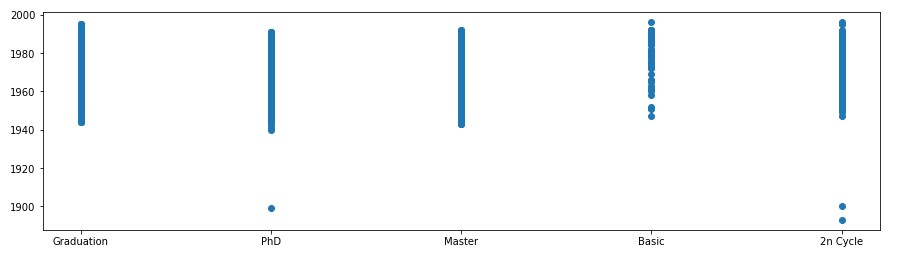


###### Education - Marital_Status plot

Same procedure for the plot

```python
# show initial plot
plt.figure(figsize=(15, 4))
plt.plot(data.Education, data.Marital_Status, ls='', marker='o')
```

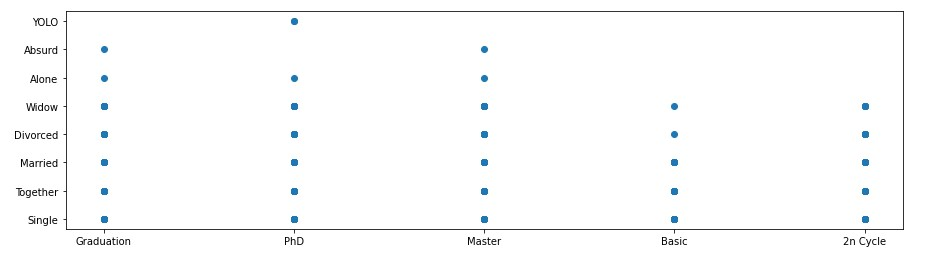


###### Marital_Status - Year_Birth

The plot from the marital status and year of birth in python is given in the same way

```python
# show initial plot
plt.figure(figsize=(15, 4))
plt.plot(data.Marital_Status, data.Year_Birth, ls='', marker='o')
```

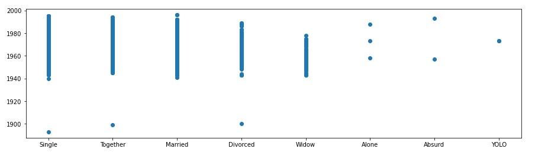


###### Education - Income

The last plot I will look into is the one between education and income

```python
# show initial plot
plt.figure(figsize=(15, 4))
plt.plot(data.Education, data.Income, ls='', marker='o')
```

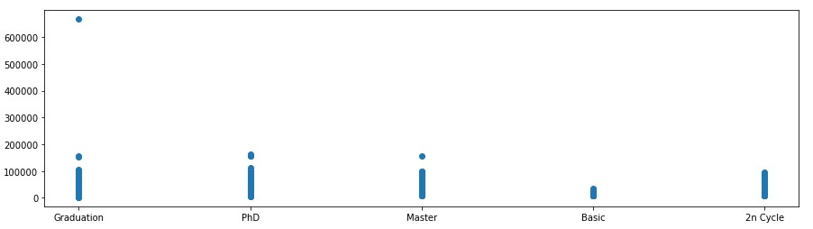

---


As a final, I also do a simple `pairplot` using Education as hue with `Seaborn`

```python
sns.pairplot(data, hue='Education', height=3)
```


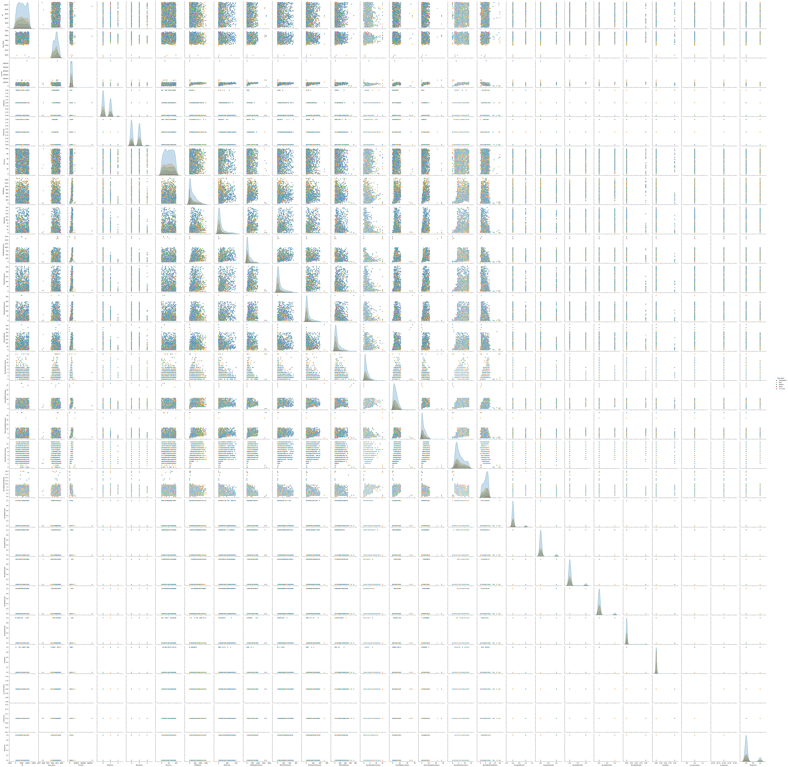


### Data Cleaning

The dataset seems to be already clean; still, it already appears clear from the various plots, that there's a too high value for the income; inspecting with a `data.max()` shows which rows is responsible for this:

```
ID                          11191
Year_Birth                   1996
Education                     PhD
Marital_Status               YOLO
Income                   666666.0
Kidhome                         2
Teenhome                        2
Dt_Customer            31-12-2013
Recency                        99
MntWines                     1493
MntFruits                     199
MntMeatProducts              1725
MntFishProducts               259
MntSweetProducts              263
MntGoldProds                  362
NumDealsPurchases              15
NumWebPurchases                27
NumCatalogPurchases            28
NumStorePurchases              13
NumWebVisitsMonth              20
AcceptedCmp3                    1
AcceptedCmp4                    1
AcceptedCmp5                    1
AcceptedCmp1                    1
AcceptedCmp2                    1
Complain                        1
Z_CostContact                   3
Z_Revenue                      11
Response                        1
dtype: object
```

This data need either to be removed (might be losing information), or we either normalize it into the values of the range of the others incomes that we have. To change I can simply do

```python
data.loc[data['Income']==666666.0, 'Income'] = 200000.0
```

to set the value to 200000.0 (which is still the maximum value but it is now normalized to the others), and I can now see that the plot is now normalized

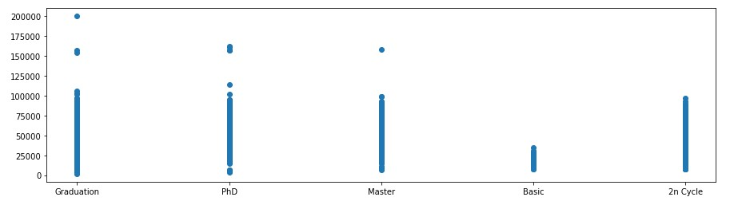

Also, it appears that there are three people born before 1900 which might be a bit weird as it would imply that, at the time the dataset was created, three people were around 100 years old (still this is not enough of an information to draw some conclusion on).

### Feature Engineering

I start by checking information with a seaborn plot to check if the data are already normalized in the centre with a

```python
sns.displot(data, bins=20)
```

and I get the following:

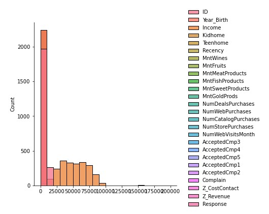


As it appears, the data have a very high count for values from 0 and 1, as many columns (like response, or Z_revenue) have standard values that are 0 or 1 (apart from Z_revenue which is always 11); I can therefore move one into making some linear regression models.

I need to modify the information I got to something that will be reproducible for our models using encoding using one hot encoding with dummies:

```python
pd.get_dummies(df['Education'], prefix='Education', drop_first=True)

df = pd.concat([df,pd.get_dummies(df['Education'], prefix='Education')],axis=1)

# now drop the original 'country' column (you don't need it anymore)
df.drop(['Education'],axis=1, inplace=True)

pd.get_dummies(df['Marital_Status'], prefix='Marital_Status', drop_first=True)

df = pd.concat([df,pd.get_dummies(df['Marital_Status'], prefix='Marital_Status')],axis=1)

# now drop the original 'country' column (you don't need it anymore)
df.drop(['Marital_Status'],axis=1, inplace=True)

pd.get_dummies(df['Dt_Customer'], prefix='Dt_Customer', drop_first=True)

df = pd.concat([df,pd.get_dummies(df['Dt_Customer'], prefix='Dt_Customer')],axis=1)

# now drop the original 'country' column (you don't need it anymore)
df.drop(['Dt_Customer'],axis=1, inplace=True)
```

After that I'll just reset the index and set all not number value remaining to 0

```python
df = df.reset_index()
df = df.fillna(0)
```


## K-means clustering

The first model I'll fit my data into is the `k-means clustering` algorithm. First of all I'll import the libraries I need and set the basic style for the plot

```python
from sklearn.preprocessing import scale
from sklearn.cluster import KMeans
from sklearn.datasets import make_blobs
from sklearn.utils import shuffle

plt.rcParams['figure.figsize'] = [6,6]
sns.set_style("whitegrid")
sns.set_context("talk")
```

and I can then add the code to plot the data and perform the k-means

```python
# helper function that allows us to display data in 2 dimensions an highlights the clusters
def display_cluster(X,km=[],num_clusters=0):
    color = 'brgcmyk'
    alpha = 0.5
    s = 20
    if num_clusters == 0:
        plt.scatter(X[:,0],X[:,0],c = color[0],alpha = alpha,s = s)
    else:
        for i in range(num_clusters):
            plt.scatter(X[km.labels_==i,0],X[km.labels_==i,0],c = color[i],alpha = alpha,s=s)
            plt.scatter(km.cluster_centers_[i][0],km.cluster_centers_[i][0],c = color[i], marker = 'x', s = 100)
            
num_clusters = 4
km = KMeans(n_clusters=num_clusters)
km.fit(X)
display_cluster(X,km,num_clusters)
```

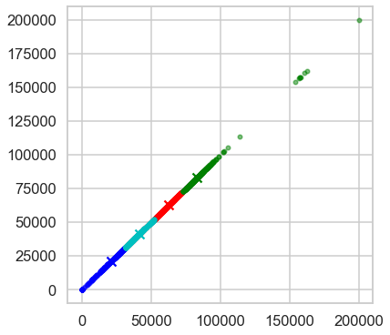


and also, I want to try with 7 different clusters

```python
num_clusters = 7
km = KMeans(n_clusters=num_clusters)
km.fit(X)
display_cluster(X,km,num_clusters)
```

and gives the following distribution

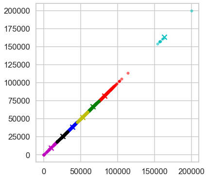


## Hierarchy clustering

Lastly, I want to try to make a complete `ward` hierarchy clustering, and see how it performs; the syntax is simply the following

```python
from scipy.cluster import hierarchy
from colorsetup import colors, palette

Z = hierarchy.linkage(X, method='ward')

fig, ax = plt.subplots(figsize=(15,5))

# Some color setup
red = colors[2]
blue = colors[0]

hierarchy.set_link_color_palette([red, 'gray'])

den = hierarchy.dendrogram(Z, orientation='top', 
                           p=30, truncate_mode='lastp',
                           show_leaf_counts=True, ax=ax,
                           above_threshold_color=blue)
```

and that shows the following plot

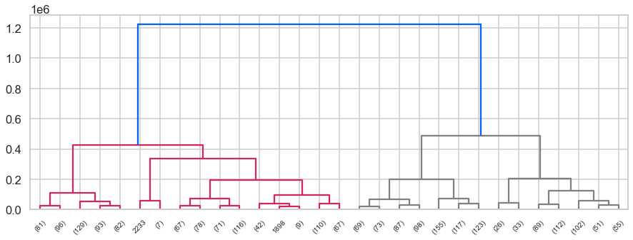


## Summary

Both models, even with different coefficients value, performed really well, and brought a very good clustering. It is to be noticed, though, that my main focus was on income, and the value I used was not high enough, even more to use some reduction algorithms.
