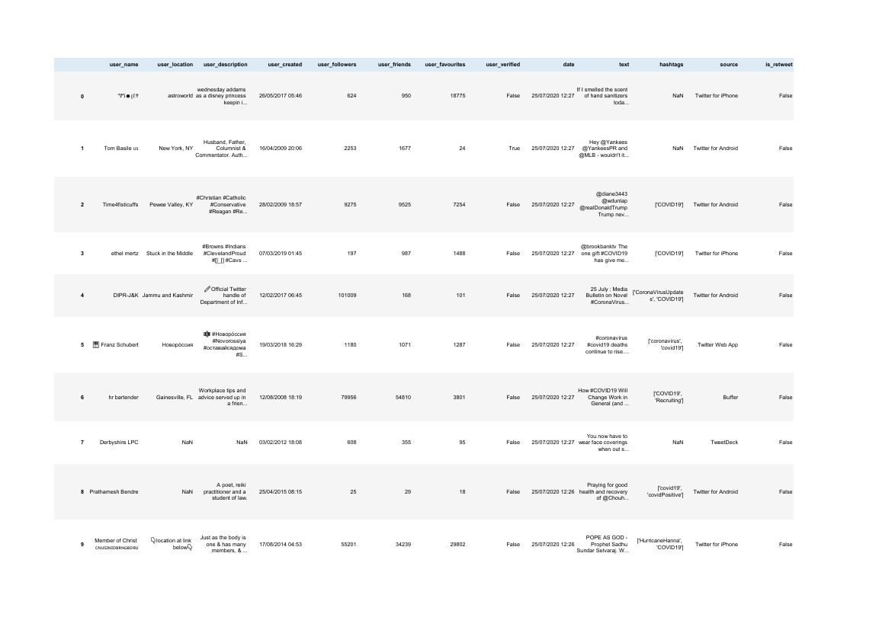
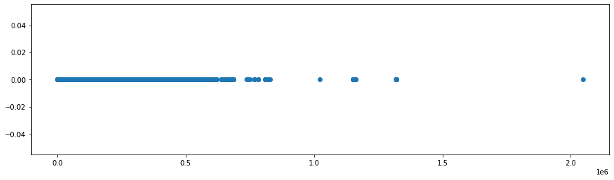
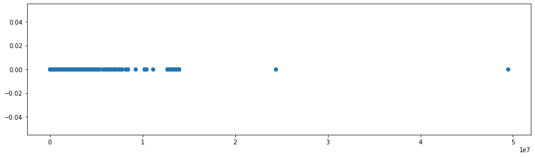
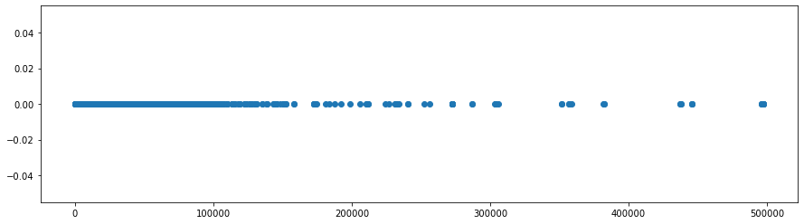
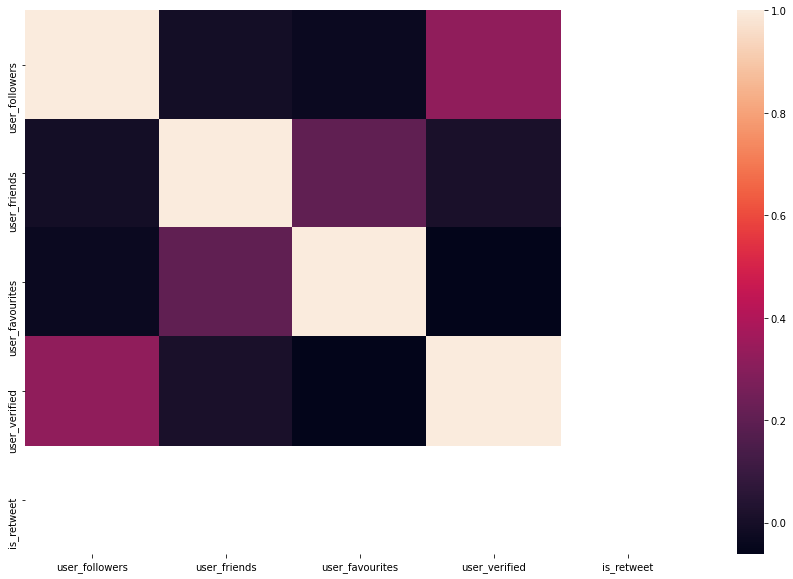
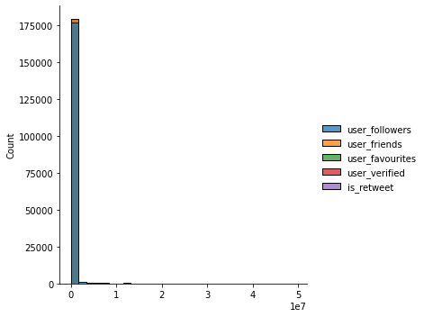

# Twitter sentiment analysis

For the Deep Learning project I took the dataset containing multiple covid tweets from Kaggle at https://www.kaggle.com/gpreda/covid19-tweets

With that in mind, my goal is to study, analyse, clean and then kame a sentiment analysis model with a `Recurrent Neural Network`.

## Exploratory data

As usual I'll start by importing the various libraries I need to work on the data

```python
import pandas as pd

# Matplot for plots
import matplotlib.pyplot as plt
%matplotlib inline

# Scikit-learn, I'll need especially for the final plots
from sklearn.model_selection import train_test_split
from sklearn.preprocessing import LabelEncoder
from sklearn.metrics import confusion_matrix, classification_report, accuracy_score
from sklearn.manifold import TSNE
from sklearn.feature_extraction.text import TfidfVectorizer

# Keras for Deep Learning
from keras.preprocessing.text import Tokenizer
from keras.preprocessing.sequence import pad_sequences
from keras.models import Sequential
from keras.layers import Activation, Dense, Dropout, Embedding, Flatten, Conv1D, MaxPooling1D, LSTM
from keras import utils
from keras.callbacks import ReduceLROnPlateau, EarlyStopping

# Natural language toolkit
import nltk
from nltk.corpus import stopwords
from  nltk.stem import SnowballStemmer

# Word2vec
import gensim

# Utility
import re
import numpy as np
import os
from collections import Counter
import logging
import time
import pickle
import itertools
```

and I'll also set the log as well as downloading the "stopwords" from the natural language processing library

```python
# Set log
logging.basicConfig(format='%(message)s', level=logging.INFO)

nltk.download('stopwords')
```

With that in mind, I can start getting the data from the file and inspect the first 10 lines

```python
# read the data from the file
filepath = 'covid19-tweets.csv'
data = pd.read_csv(filepath, sep=',')

data.head(10)
```





and then inspect the content of the *main attributes* for this dataset with `data.dtypes`

```
user_name           object
user_location       object
user_description    object
user_created        object
user_followers       int64
user_friends         int64
user_favourites      int64
user_verified         bool
date                object
text                object
hashtags            object
source              object
is_retweet            bool
dtype: object
```


### Visual representation

I will make some visual representation of the various data I have to have a better visual representation of the information I have

```python
plt.figure(figsize=(15, 4))
plt.plot(data.user_verified, data.is_retweet, ls='', marker='o')
```




```python
plt.figure(figsize=(15, 4))
plt.plot(data.user_followers, data.is_retweet, ls='', marker='o')
```




```python
plt.figure(figsize=(15, 4))
plt.plot(data.user_friends, data.is_retweet, ls='', marker='o')
```




and plot the heatmap as well

```python
import seaborn as sns

fig, ax = plt.subplots(figsize=(15,10)) 
sns.heatmap(data.corr())
```




## Data cleaning and feature engineering

I want to check the data and see if it's skewed or if there's something to be working on. Since I'll work on a `DeepLearning` model, the more features I have, the better I can work on, but I still need to ensure that the information is cleaned for the processing. To see if the data are skewed I use a simple `displot` and see if they're already normalized




As it seems almost all the data we have is in a range 0-1 with the majority being in the 0, therefore no further data cleaning is required, and I can keep these features for making analysis on the data.


## Deep Learning model

In order to create a sentiment analysis I start by creating a new column into our `DataFrame` with random value and then adjust it for simple decoding sentiments for starting information

```python
# Add column with zeroes
data['target'] = np.random.choice([-1, 0, 1], data.shape[0])

dec_map = {-1: "Negative",0: "Neutral", 1: "Positive"}

# Simple function to decode the sentiment
def dec_sentiment(label):
    return dec_map[int(label)]

# We add the column target on the DataFrame
data.target = data.target.apply(lambda x: dec_sentiment(x))
```

With that in mind, I can add the information for the English language

```python
sw = stopwords.words("english")
stem = SnowballStemmer("english")
```


It's important now to clean the text for the tweets from information regarding users and links, and for that a regex will be used

```python
def text_preprocess(text, stem=False):
    
    text = re.sub("@\S+|https?:\S+|http?:\S|[^A-Za-z0-9]+", ' ', str(text).lower()).strip()
    tokens = []
    
    for token in text.split():
        if token not in stop_words:
            if stem:
                tokens.append(stemmer.stem(token))
            else:
                tokens.append(token)
    return " ".join(tokens)

data.text = data.text.apply(lambda x: text_preprocess(x))
```

And then split our data for train and test split (with 70-30 split)

```python
X_train, X_test = train_test_split(data, test_size=0.3, random_state=42)

print("train size:", len(X_train))
print("test size:", len(X_test))
```

with which I'll have

- train size: 125375
- test size: 53733


### Using word2vec

I now add the w2v library to learn word associations from a large document

```python
doc = [_text.split() for _text in X_train.text]

w2v = gensim.models.word2vec.Word2Vec(vector_size=200, window=7, min_count=7, workers=8)
w2v.build_vocab(doc)
```

and from that I can create my words vocabulary

```python
words = w2v.wv.index_to_key
vocabulary_size = len(words) # in my case it will 15467
```

and with that I can train my model (I'll stick to 50 epochs to make it a bit faster)

```python
w2v.train(doc, total_examples=len(doc), epochs=50)
```


#### Test the results

After the train is complete, I can inspect the content of the model and look for the most similar sentiment content given specific information, for example I can try with `w2v.wv.most_similar("covid")` and I get the following

```
[('covid19', 0.4595447778701782),
 ('coronavirus', 0.38082993030548096),
 ('364', 0.2836289703845978),
 ('842', 0.273364782333374),
 ('corona', 0.25135260820388794),
 ('versus', 0.24311982095241547),
 ('covid19sa', 0.239445760846138),
 ('new', 0.2327510267496109),
 ('associated', 0.2262677699327469),
 ('90', 0.22575807571411133)]
```

I can now tokenize the text, create the new training and test data, and encode the information

```python
tokenizer = Tokenizer()
tokenizer.fit_on_texts(X_train.text)

vocabulary_size_new = len(tokenizer.word_index) + 1
print("Total words with the new vocubalary", vocabulary_size_new)

X_train_new = pad_sequences(tokenizer.texts_to_sequences(X_train.text), maxlen=200)
X_test_new = pad_sequences(tokenizer.texts_to_sequences(X_test.text), maxlen=200)

enc = LabelEncoder()
enc.fit(X_train.target.tolist())

y_train = enc.transform(X_train.target.tolist())
y_test = enc.transform(X_test.target.tolist())

y_train = y_train.reshape(-1,1)
y_test = y_test.reshape(-1,1)

# Add an emberring layer
layer_matrix = np.zeros((vocabulary_size_new, 200))

for word, i in tokenizer.word_index.items():
  if word in w2v.wv:
    layer_matrix[i] = w2v.wv[word]
    
print(layer_matrix.shape)

# Embed it
embedding_layer = Embedding(vocabulary_size_new, 200, weights=[layer_matrix], input_length=200, trainable=False)
```

Finally, I can build, compile and run the model

```python
# Numpy requirement
# https://stackoverflow.com/questions/66207609/notimplementederror-cannot-convert-a-symbolic-tensor-lstm-2-strided-slice0-t
model = Sequential()
model.add(embedding_layer) # note that it requires numpy 1.19
model.add(Dropout(0.5))
model.add(LSTM(100, dropout=0.2, recurrent_dropout=0.2))
model.add(Dense(1, activation='sigmoid'))

model.compile(loss='binary_crossentropy', optimizer='adam', metrics=['accuracy'])

# add the callback functions
callbacks = [ReduceLROnPlateau(monitor='val_loss', patience=5, cooldown=0),
             EarlyStopping(monitor='val_accuracy', min_delta=1e-4, patience=5)]

# fit the model; to speed up things I'll use only 5 this time
history = model.fit(X_train_new, y_train, batch_size=1024, epochs=5, 
                    validation_split=0.1, verbose=1, callbacks=callbacks)
```

With that in place, the final thing remained is to create the function for prediction, add the test and prediction to it and plot the confusion matrix

```python
def dec(score):
    if score <= -0.4:
        return "Negative"
    elif score >= 0.4:
        return "Positive"
    
    return "Neutral"

def predict(text):
    start_at = time.time()
    
    # Tokenize text
    X_test = pad_sequences(tokenizer.texts_to_sequences([text]), maxlen=200)
    
    # Predict
    score = model.predict([X_test])[0]
    
    # Decode sentiment
    label = decode_sentiment(score)

    return {"label": label, "score": float(score), "elapsed_time": time.time()-start_at}

y_pred_new = []
y_test_new = list(X_test.target)

scores = model.predict(X_test_new, verbose=1, batch_size=5000)
y_pred_new = [dec(score) for score in scores]
```

## Summary

In case the model need to be reused I can simply save it 

```python
model.save('model.h5')
w2v.save('w2v_model.w2v')
pickle.dump(tokenizer, open('tokenizer.pkl', 'wb'), protocol=0)
pickle.dump(enc, open('encoder.pkl', 'wb'), protocol=0)
```


Even though the model works well, it is to be said that I had to provide the various initial sentiments, and for that the accuracy itself could have been biased.

It should be tested again a larger dataset containing the various information about the initial sentiment and make it running for longer epochs to ensure that it is more accurate.

