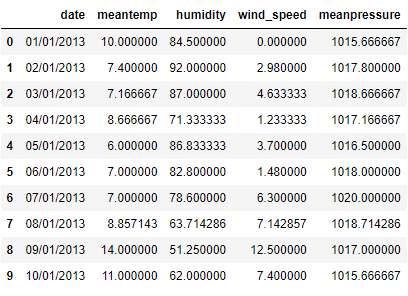

# Daily Climate time series

For the last project I took the Dataset fully dedicated for the developers who want to train the model on Weather Forecasting for Indian climate. This dataset provides data from 1st January 2013 to 24th April 2017 in the city of Delhi, India, with the following attributes

- **meantemp**
- **humidity**
- **wind_speed**
- **meanpressure**


## Exploratory data

I'll start by opening the data and start inspecting its content. I start by importing the basic libraries

```python
import pandas as pd
import numpy as np 
import matplotlib.pyplot as plt
import seaborn as sns
import warnings

from datetime import datetime
from datetime import timedelta

import statsmodels as ss

from dateutil.relativedelta import relativedelta
from IPython.display import display

from colorsetup import colors, palette
```

and the start reading the file

```python
# read the data from the file
filepath = 'heart.csv'
data = pd.read_csv(filepath, sep=',')

data.head(10)
```




To ensure that the attributes are the actually said we do a simple `data.dtypes` and we can see the following

```
date             object
meantemp        float64
humidity        float64
wind_speed      float64
meanpressure    float64
dtype: object
```


and we can see that, apart from the date that is an object (most likely of type `Date`), all other information is of type `float` which means that I can work with that by default without having to clean it


### Visual representation

Before delving deeper into analysis and time series work, I start by plotting information first


---

#### Date vs mean temperature

I start plotting the information of `date` and `meantemp`

```python
plt.figure(figsize=(15, 4))
plt.plot(data.cp, data.age, ls='', marker='o')
```


#### Date vs humidity

Next I compare `date` and `humidity`

```python
plt.figure(figsize=(30, 4))
plt.plot(data.date, data.humidity, ls='', marker='o')
```


#### Date vs wind speed

Now, I do a comparison between `date` and `wind speed`

```python
plt.figure(figsize=(30, 4))
plt.plot(data.date, data.wind_speed, ls='', marker='o')
```


#### Date vs mean pressure

Last plot I do is between `date` and `mean pressure`

```python
plt.figure(figsize=(30, 4))
plt.plot(data.date, data.meanpressure, ls='', marker='o')
```


---


Finally, I do a simple heatmap of the data.


## Data cleaning and feature engineering

Even though the dataset seems already clean as it is, I still want to check if some cleaning is to be done and then check if I need to make some works for feature engineering. For data cleaning I start by checking if there are some `min` (with `data.min()`) and `max` (with `data.max()`) that are too out of scale. The min value we have is the following:

```
date            01/01/2013
meantemp               6.0
humidity         13.428571
wind_speed             0.0
meanpressure     -3.041667
dtype: object
```


whereas the maximum is the following

```
date             31/12/2016
meantemp          38.714286
humidity              100.0
wind_speed            42.22
meanpressure    7679.333333
dtype: object
```


The only thing that might result into an outlier is the `meanpressure` as it has a very bi gap in between them. As for the feature engineering a do a simple `displot` and see if I have very skewed data.


and here too, the data are already normalized as they are, so no further feature engineering is required.


## Time series work

I can now work on the actual data for time series engineering. First of all I'll change the date to make it numpy like, and then start making analysis on the data for time series. To make the change I just need the following command

```python
data['date'] = data.date.astype('datetime64[ns]')
```


and it will convert the date to the correct value. Before going on, I'll change the index of our data frame for the date

```python
data.set_index('date', inplace=True)
```


Then I will add the various range to plot (weekly, monthly, and quarterly). First create a new index

```python
new_index = data.index
print(new_index)
```


and that gives the following index

```
DatetimeIndex(['2013-01-01', '2013-02-01', '2013-03-01', '2013-04-01',
               '2013-05-01', '2013-06-01', '2013-07-01', '2013-08-01',
               '2013-09-01', '2013-10-01',
               ...
               '2017-04-15', '2017-04-16', '2017-04-17', '2017-04-18',
               '2017-04-19', '2017-04-20', '2017-04-21', '2017-04-22',
               '2017-04-23', '2017-04-24'],
              dtype='datetime64[ns]', name='date', length=1576, freq=None)
```


with that I can create the new `DataFrame` based on the new index and create the range I want

```python
date_new = data.reindex(index=data.index, columns=data.columns)

temp_weekly = date_new.resample('W').sum()
print('Weekly data')
print(temp_weekly.head(), '\n')

temp_monthly = date_new.resample('M').sum()
print('Monthly data')
print(temp_monthly.head(), '\n')

temp_quarterly = date_new.resample('Q').sum()
print('Quarterly data')
print(temp_quarterly.head(), '\n')

temp_annual = date_new.resample('Y').sum()
print('Annual data')
print(temp_annual.head(), '\n')
```


that gives the following ranges

```
Weekly data
              meantemp    humidity  wind_speed  meanpressure
date                                                        
2013-01-06  132.565476  322.190476   56.809881   6058.083333
2013-01-13  179.404762  470.723810   39.406190   7048.104761
2013-01-20   95.500000  571.642857   29.700000   7119.976191
2013-01-27   86.307143  474.238095   33.393810   7142.359524
2013-02-03  102.558333  481.100000   30.988214   7121.908333 

Monthly data
              meantemp     humidity  wind_speed  meanpressure
date                                                         
2013-01-31  553.650000  2096.323810  170.264524  31439.239285
2013-02-28  574.530952  1885.254762  233.406786  28347.132143
2013-03-31  746.992857  1785.296429  266.074524  31296.442858
2013-04-30  833.915476  1341.967857  216.476310  30192.420240
2013-05-31  959.652381  1282.446429  267.230714  31077.267858 

Quarterly data
               meantemp     humidity  wind_speed  meanpressure
date                                                          
2013-03-31  1875.173810  5766.875000  669.745833  91082.814287
2013-06-30  2647.984524  4558.916667  719.482619  91312.877384
2013-09-30  2561.815476  6381.471429  646.066429  92317.678572
2013-12-31  1963.921429  6304.633333  456.652619  93076.022622
2014-03-31  1875.321429  6091.607143  569.917857  91131.196428 

Annual data
               meantemp      humidity   wind_speed   meanpressure
date                                                             
2013-12-31  9048.895238  23011.896429  2491.947500  367789.392865
2014-12-31  9128.895542  21815.298757  2465.993978  368046.715541
2015-12-31  9166.825893  22422.128869  2365.420089  368224.709824
2016-12-31  9919.834526  21498.903656  2621.467622  373158.030368
2017-12-31  2485.290997   6513.453249   928.407342  115476.000226 
```


and from that I can plot the various data as well

```python
plotsize = (13, 5)

temp_quarterly.plot(figsize=plotsize, title='Quarterly temp')
```


```python
temp_monthly.plot(figsize=plotsize, title='Monthly temp')
```


and finally the weekly data as well

```python
temp_weekly.plot(figsize=plotsize, title='Weekly temp')
```


## Summary

All the three different models plotted shows a very similar trend; as I previously imagined, the value for the meanpressure might as well be an outlier since it's very out of scale, but as a general overview it's easily to see how lately the situation got worse and worse.

As a future improvement, I would like to inspect data from 2017 up to 2021 to have more insights on the various climate change.


